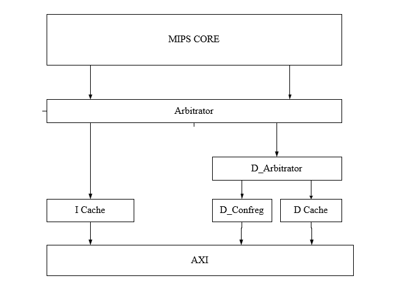
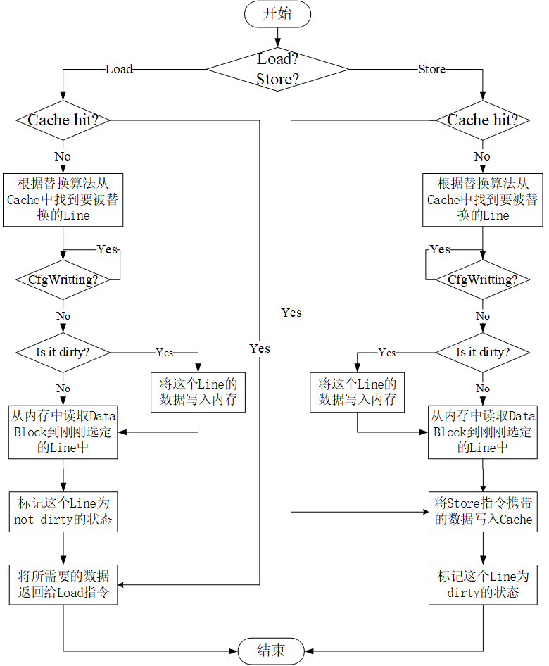
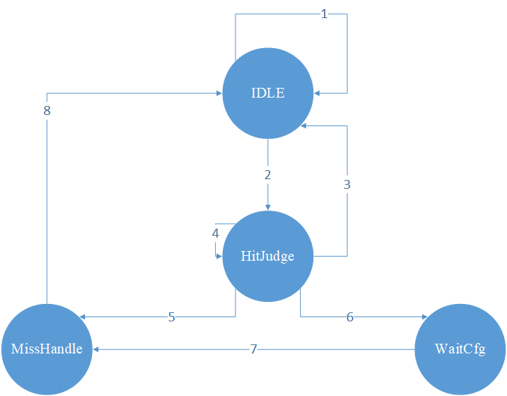

# XXMIPS初赛设计文档

> 
第六届全国大学生计算机系统能力培养大赛

>
> 
重庆大学

>
> 
陈泱宇 李燕琴 王梓宇 张翀

## 概述

### 项目背景

本项目依托于龙芯杯提供的FPGA实验平台、Soc工程环境以及基准测试程序，设计并实现了一个部分兼容 MIPS32 体系结构的小端序 CPU。通过运行大赛提供的功能测试、性能测试和系统测试，我们一定程度上证明了该处理器的正确性。

### 项目概述

XXMIPS，采用了对称双发射五级顺序流水线的设计，并支持指令FIFO和数据缓存，以提升系统性能。指令FIFO可以隔离取指阶段和后续阶段以实现高效取指的作用。高速缓存Cache采用二路组相联且块多字的方式，一块8字，行宽 32 字节，大小为 18 KB。

### 名词解释

- GPR: General Purpose Register，通用寄存器

## CPU设计方案

XXMIPS的设计为双发射五级顺序流水线CPU。其中，双发射，采用对称双发逻辑，其对应的双发策略能最大保证双发率；五级顺序流水线由取指（Instruction Fetch）、译码（Instruction Decode）、执行（Excute）、访存（Memory access），写回（Write Back）五个阶段。CPU由数据通路模块、高速缓存模块、仲裁模块组成。

### Datapath

LaunchMIPS的数据通路示意图如下，其中红线部分为master path，蓝线部分为slave path。在对称双发射中，master和slave的主要区别在于前者PC小于后者，在处理异常、提交等事宜，会被优先处理。当然，上述的“对称”双发射，只是相对于只支持ALU指令双发的非对称逻辑而言，是对称的，因为slave path支持的指令更多。但严格来讲，并不是绝对对称，在处理跳转、自陷等指令时，需要优先在master处理，这在后续的双发策略中会详细说明。

#### 双发策略

因为双发策略会影响这个数据通路的设计，故我们先来介绍一下XXMIPS的双发策略。其中双发逻辑的判断在`issueCtrl`模块中，也是整个双发策略的核心解释。

1. `only_master`类指令

   对于自陷指令和特权指令，会直接触发异常，导致PC会跳转到异常处理地址或返回地址处，且会刷新整个流水线。对于这类指令，如果在slave中检测到这类指令，则暂停slave发射，将其延迟到下一周期的master发射；如果在master中检测到这类指令，也会暂停slave发射，避免不必要的流水线刷新。

2. `only_in_master`类指令

   对于跳转指令，在一定条件下会跳转到其他地址，并刷新整个流水线。和`only_master`不同的是，跳转指令会涉及到延迟槽的处理。故如果在slave中检测到这类指令，则暂停slave发射，将其延迟到下一周期的master发射；如果在master中检测到这类指令，若满足slave发射条件，则发射该条指令（延迟槽），若不满足，则在下一周期的master中发射延迟槽数据。

3. 数据冲突

   1. RAW（Read After Write）：如果master和slave之间存在HiLo寄存器的WRA或GPR的RAW情况，则slave不发射。
   2. Load to use：如果slave使用到的寄存器是其上上条指令的访存结果，则slave不发射。

4. 结构冲突

   如果master和slave同时需要CP0寄存器或访存，则slave不发射。

5. 数据有效性

   slave发射的前提是master必须要发射，如果遇到master暂停发射或指令FIFO为空的情况下，slave不发射。

#### 取指阶段

为了保证双发射能够正常执行，第一要素便是取指，即每次取指需要取回2条指令，才能保证传到D时，至少有两条指令可以准备用于双发射。依托于指令cache块多字的设计，XXMIPS中采取的策略是，传入指令cache一个地址，传回该地址PC及其后面PC+4共两条指令。值得注意的是，为了简化cache命中逻辑，传回数据中，并不是所有PC都会传回2条指令，故我们添加了`inst_data_ok`信号表示取回的指令是否有效。XXMIPS中，指令cache共8字，如下图(b)所示，如果PC索引到该块的最后一个字，cache只传回1条指令，`inst_data_ok2`置为0；除此之外，传回两条数据，`inst_data_ok1`和`inst_data_ok2`均置为1。

出于双发策略中，slave并不是每次都会发射，故取回的数据需要缓存下来，以用于下次使用，节省cache访问时间。XXMIPS中，使用指令FIFO，将传回的有效指令缓存下来，且可以分割取指和后续阶段，即取指不受后续阶段产生的stall影响（但为了保证结果的正确执行，后续阶段会受到指令cache产生的stall影响）。其中，如果指令FIFO放满，则暂停取指；如果指令FIFO为空，则暂停发射。

#### 译码阶段

Instruction Decode阶段中，主要完成以下操作：

1、译码：从FIFO中读出指令，立即进入译码模块。

2、发射判断和数据准备：译码结束后，一方面需要进入`issue_ctrl`模块进行发射判断，发射判断结果会返回到指令FIFO中，控制FIFO的读指针的增量。另一方面，需要进入`regfile`中读取对应的数据。准备号数据后进入Excute阶段执行。

其中，在D阶段如果遇到跳转指令，默认不跳转，进入E后处理，避免前推数据经过的路径太长。

#### 执行阶段

Excute阶段中，主要完成以下操作：

1、Branch跳转判断：如果此时遇到跳转指令，根据情况进行是否跳转的判断。

2、ALU计算：可以处理单周期运算指令和多周期运算指令。其中，多周期运算指令（包括2周期乘法指令、36周期除法指令等），在运算完成前会产生stall信号，阻塞D、E、M、W四个阶段。其中，流水线master和slave各有一个乘法器和除法器。

3、访存仲裁及其地址计算：由于data cache是bram结构，需要一个周期取出指令，我们需要在E阶段将访存信号传递给data cache。因为master和slave都支持访存（但不会同时访存），故在传递访存前，需要用`Struct Conflict`模块进行仲裁，并保证`M_flush`置0以使访存信号能由E阶段正常传到M阶段，保证M阶段的数据传回。同时，为了减少访存地址计算经过的路径，我们分离了E阶段中的ALU路径和MEM路径，单独利用`base(rs value) + offset(immediate value)`计算访存地址。

#### 访存阶段

Memory Access阶段，主要完成以下操作：

1、访存控制：虽然在E阶段传递给了data cache基本的访存信号，告知data cache需要准备对应地址的数据；但是并没有告知需要取出的数据的比特数，也未根据访存比特要求对传给data cache的地址进行地址错例外判断（`AdEl`和`AdEs`判断）。故我们在M阶段，利用`memory_access`模块进行了以上的判断。如果一旦发生错误，M阶段传给data cache的握手信号`data_sram_enM`将会置为0，阻止data cache将错误的地址传到AXI总线上。反之，则正常发送`data_sram_enM`信号，并得到传回的数据，再通过`Struct Conflict`模块，将数据交付到对应`path`（master或slave）上。

2、写回数据选择：master和slave两条路径上的计算结果和访存结果的选择。

3、异常处理：主要有两个来源，一是访问CP0中的Cause寄存器和Status寄存器获取异常信息，二是从F阶段开始随当前指令逐级往后传递异常（包括8类异常：`except = [trap, PC_exp, syscall, break, eret, undefined, overflow, adel, ades]`）。由此记录异常类型和异常地址。

4、CP0模块的更新：E阶段写入，M阶段刚好出结果，避免了CP0数据的前推。更新来源有`MTC0`指令、异常处理模块传出的异常类型，更新内容包括EPC、Cause、Status等寄存器内容。

#### 写回阶段

Write Back阶段，主要执行写回寄存器请求。

### 冲突处理

#### 数据冲突

1、RAW（Read After Write）冲突：当master或slave需要读取的数据是已经发射且进入后续流水阶段的指令，会产生RAW冲突。本设计将需要的数据均前推到D阶段，前推后立即进入触发器，避免前推数据所在关键路径过长。其中，若需要读取的数据是当前E阶段的访存数据，则需要进行阻塞以等待访存数据在M阶段返回。若需要读取的数据是当前E阶段的计算结果、或M阶段的计算结果、或M阶段的访存结果，则通过`forward_top`模块前推到D阶段。

2、WAW（Write After Write）冲突：当同周期的master和slave写入寄存器的地址一致时，会产生WAW冲突。因为slave是master后一条指令，故regfile更新时，若存在WAW冲突，则优先写入slave的结果。

3、WAR（Write After Read）冲突：由于本设计为顺序流水线，故不存在WAR冲突。

#### 控制冲突

当遇到跳转指令时，会产生控制冲突。MIPS指令系统中，跳转指令包含延迟槽。本设计中，跳转判断在E阶段进行，以保证跳转判断所需要的数据均已备齐。如果跳转，则更新F阶段的PC寄存器值，同时刷新D和E阶段。此外，如果此时延迟槽并没有在slave发射：如果延迟槽数据仍在FIFO中，则不能刷新此时D→E阶段的数据；否则，FIFO需要保存F刚取回的数据并发射。

#### 结构冲突

当master和slave同为访存指令或访问CP0指令时，会产生结构冲突。本设计中，结构冲突的指令只发射一条，保证CPU正确执行。

### 异常处理

为使处理器的功能完整，XXMIPS支持异常处理。根据MIPS规范要求，XXMIPS支持精确异常，即出现异常后，准确记录发生异常的指令地址，并存放在EPC寄存器中以待异常返回时使用；且保证发生异常前的所有指令正常提交；发生异常的指令及其之后的指令不提交，并跳转至异常处理程序入口进行异常处理。XXMIPS中支持的指令优先级顺序如下：

- 中断例外：Int，包括硬件中断、软件中断和计时器中断。
- 地址错例外（取指）：PC地址未对齐四字节。
- 保留指令例外：当执行一条未实现的指令时，触发保留指令例外。
- 自陷例外、系统调用例外：执行到Syscall、Break等自陷指令时。
- 整型溢出例外：执行ADD，SUB，ADDI，SUBI等指令发生溢出时。
- 地址错例外（数据访问）：访问数据的地址未对齐，包括AdEl、AdEs两类错误。

### Cache设计

#### AXI总线设计

AXI的访问接口设计如下，Arbitrator用于集中处理I Cache和D_Arbitrator发来的AXI请求，当读请求冲突时，优先发送读指令请求，并用arid=0代表指令，arid=1代表数据，对应地，接收数据时也根据rid的值来分发数据。

访问uncached数据的指令由D_Confreg模块单独负责。当写uncached的数据时，会由D_Confreg模块发起写外设请求，除非下一条数据访存指令也访问外设，否则写外设这一过程将不会阻塞流水线。

#### Cache结构

I Cache和D Cache都为2路组相联，1 bit 伪LRU替换算法，每路8KB，共16KB，每块8个字。Valid位与tag都存在RAM里，dirty位则采用Reg实现。为了便于debug及后续上操作系统，我们不调用Xilinx IP核实现RAM，而是自己手写了相关功能模块以模拟Xilinx IP核生成的RAM的功能。

#### Cache状态机

I Cache的状态机较为简单，且与D Cache的状态机有很大重复，因此这里只介绍D Cache的状态机，下面是它的处理流程图（此流程图较大程度上参考了：姚永斌，《超标量处理器设计》p28，写回写分配cache）

上图中的CfgWritting是一个由D_Confreg传过来的1位信号，值为1表示此时正在写外设，AXI写通道被占用，因此当需要替换脏数据到内存中时，需要先检查此时写通道是否被占用，如果被占用，则会自旋直至其空闲。

Cache的具体状态转移如下图所示：

**状态：**

- IDLE：空闲状态

- HitJudge：Cache正在进行是否命中的判断

- MissHandle：Cache未命中，数据缺失，此时Cache正在读/写内存

- WaitCfg：Cache未命中，数据缺失，但此时正在写uncached数据，写通道被占用

**路径：**

- Path 1：无访存指令，Cache空闲

- Path 2：Cache收到访存指令且此时Mem阶段的Stall信号为低，取出其对应Line的数据并进行Hit判断

- Path 3：Cache命中且下一条指令(也即处于Master线的EXE阶段指令)不为访存指令

- Path 4：Cache命中且下一条指令也为访存指令，此时保持HitJudge状态，以判断是否连续命中

- Path 5：Cache未命中且此时写通道空闲，Cache进入缺失处理

- Path 6：Cache未命中，但此时正在写uncached数据，写通道被占用，将等待直至写通道空闲

- Path 7：Cache未命中，此时写通道空闲，状态转到MissHandle进入缺失处理

- Path 8：缺失处理完成，回到空闲状态

**重要的补充点说明：**

​    1）所有的地址和使能信号都提前一个周期传入Cache并在下一个周期时取出用于判断是否Hit。

​    2）Cache Line的data部分有多个RAM实例，每个字都有对应的写使能，AXI每返回一个数据就将其写入到对应地址。

​    3）当Cache未命中且此时为Load型指令且需要替换的数据为脏，则会同时向AXI发起写请求和读请求。D Cache发起写请求时，写通道必定空闲，所以写操作总是会先于读操作覆盖其数据前完成(如果同时发起读写请求时读写通道都空闲，那么写操作依然会比读操作快1个周期)

#### 替换算法

我们采用的是2路组相联Cache，1bit 伪LRU替换算法，其原理很简单。一共有两种情况需要改变LRU位，一是Cache命中时，二是其缺失时。如果Cache命中，则把命中路地址的LRU位标记为另外那条没有命中的Line，如果是Cache未命中，则会根据对应地址的LRU位选择替换路并读入新数据，此时只需将对应地址的LRU位取反即可。

## 总结

本设计，相较于重庆大学往届参赛队，做出了两大突破。一是双发射的设计，二是cache的优化，使得XXMIPS得以支持主频100Mhz，取得66.477的性能分。接下来的时间，我们将继续在系统软件方面进击。

## 参考文献

- 计算机组成与设计: 硬件/软件接口. David A.Patterson
- 自己动手写 CPU. 雷思磊
- CPU设计实战. 汪文祥，邢金璋
- 超标量处理器设计. 姚永斌
- MIPS® Architecture For Programmers I, II, III. Imagination Technologies LTD.
- Cache 实验指导书.重庆大学
- Sirius 设计文档. 于海鑫，尹思维
- PipelineMips 设计报告. 袁福焱，李果，李雅雯，江焰丰

## 附录

### 支持的指令集

- 算术运算指令
  - ADD: Add Word
  - ADDI: Add Immediate Word
  - ADDIU: Add Immetiade Add Immediate Unsigned Word
  - ADDU: Add Unsigned Word
  - CLO: Count Leading Ones in Word
  - CLZ: Count Leading Zeros in Word
  - DIV: Divide Word
  - DIVU: Divide Unsigned Word
  - MADD: Multiply and Add Word to Hi,Lo
  - MADDU: Multiply and Add Unsigned Word to Hi,Lo
  - MSUB: Multiply and Subtract Word to Hi,Lo
  - MSUBU: Multiply and Subtract Word to Hi,Lo
  - MUL: Multiply Word to GPR
  - MULT: Multiply Word
  - MULTU: Multiply Unsigned Word
  - SLT: Set on Less Than
  - SLTI: Set on Less Than Immediate
  - SLTIU: Set on Less Than Immediate Unsigned
  - SLTU: Set on Less Than Unsigned
  - SUB: Subtract Word
  - SUBU: Subtract Unsigned Word
- 逻辑运算指令
  - AND: And
  - ANDI: And Immediate
  - NOR: Not Or
  - OR: Or
  - ORI: Or Immediate
  - XOR: Exclusive OR
  - XORI: Exclusive OR Immediate
- 移位指令
  - SLL: Shift Word Left Logical
  - SLLV: Shift Word Left Logical Variable
  - SRA: Shift Word Right Arithmetic
  - SRAV: Shift Word Right Arithmetic Variable
  - SRL: Shift Word Right Logical
  - SRLV: Shift Word Right Logical Variable
- 跳转指令
  - BAL: Branch and Link
  - BEQ: Branch on Equal
  - BGEZ: Branch on Greater Than or Equal to Zero
  - BGEZAL: Branch on Greater Than or Equal to Zero and Link
  - BGTZ: Branch on Greater Than Zero
  - BLEZ: Branch on Less Than or Equal to Zero
  - BLTZ: Branch on Less Than Zero
  - BLTZAL: Branch on Less Than Zero and Link
  - BNE: Branch on Not Equal
  - J: Jump
  - JAL: Jump and Link
  - JALR: Jump and Link Register
  - JR: Jump Register
- 内陷指令
  - BREAK: Breakpoint
  - SYSCALL: System Call
- 特权指令
  - ERET: Exception Return
  - MFC0: Move from Coprocessor 0
  - MTC0: Move to Coprocessor 0
- 访存指令
  - LB: Load Byte
  - LBU: Load Byte Unsigned
  - LH: Load Halfword
  - LHU: Load Halfword Unsigned
  - LUI: Load Upper Immediate
  - LW: Load Word
  - SB: Store Byte
  - SH: Store Halfword
  - SW: Store Word
- 数据移动指令
  - MFHI: Move From HI Register
  - MFLO: Move From LO Register
  - MTHI: Move to HI Register
  - MTLO: Move to LO Register
  - MOVN: Move Conditional on Not Zero
  - MOVZ: Move Conditional on Zero
- Trap指令
  - TEQ: Trap if Equal
  - TEQI: Trap if Equal Immediate
  - TGE: Trap if Greater or Equal
  - TGEI: Trap if Greater or Equal Immediate
  - TGEIU: Trap if Greater or Equal Immediate Unsigned
  - TGEU: Trap if Greater or Equal Unsigned
  - TLT: Trap if Less Than
  - TLTI: Trap if Less Than Immediate
  - TLTIU: Trap if Less Than Immediate Unsigned
  - TLTU: Trap if Less Than Unsigned
  - TNE: Trap if Not Equal
  - TNEI: Trap if Not Equal Immediate
- 其他指令
  - NOP: No Operation(Assembly Idiom)
  - SYNC: Synchronize Shared Memory
  - SYNCI: Synchronize Caches to Make Instruction Writes Effective

- 待添加指令
  - B: Unconditional Branch
  - CACHE: Perform Cache Operation
  - LWL: Load Word Left
  - LWR: Load Word Right
  - SSNOP: Superscalar No Operation(Pseudo instruction)
  - SWL: Store Word Left
  - SWR: Store Word Right
  - TLBP: Probe TLB for Matching Entry
  - TLBR: Read Indexed TLB Entry
  - TLBWI: Write Indexed TLB Entry
  - TLBWR: Write Random TLB Entry
  - WAIT: Enter Standby Mode
