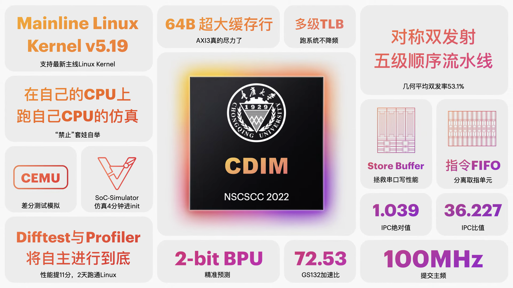

# CQU Dual Issue Machine

@So the delay slot will disappear, right?

@Chongqing University

@[NSCSCC2022](http://www.nscscc.com/)

## Info

CDIM，CQU Dual Issue Machine，为双发射五级顺序流水线CPU，支持指令FIFO、分支预测、指令缓存和数据缓存、Store Buffer、两级TLB等特殊单元，以提升系统性能；CDIM还支持U-Boot引导程序，并基于该引导程序，成功运行uCore和Linux操作系统。

- 五级顺序流水线由取指（Instruction Fetch）、译码（Instruction Decode）、执行（Excute）、访存（Memory access），写回（Write Back）五个阶段组成。
- 双发射采用对称双发逻辑以充分保证双发率。
- 指令FIFO可以隔离取指阶段和后续阶段，以实现高效取指的作用。
- 分支预测采用静态分支预测单元以减少跳转带来流水线刷新数，利用PC低位记录跳转数据，利用传统2bit策略更新跳转数据的记录。
- 指令缓存和数据缓存均采用二路组相联和突发传输的设计，单路均为4KB以满足伪VIPT对虚拟内存最小页面的要求，其中指令缓存的数据行为64bit以适应双发取指要求，数据缓存的数据行为32bit。
- Store Buffer可缓存Uncached的写AXI请求，以降低写AXI带来的流水线阻塞数。
- 两级TLB可以减少映射地址翻译模式的时延和缺失率。

## Branch

- `master`：主分支，8.16后的整理汇总
- `doc`：项目说明，统一`.gitignore`文件。
- `lyq_axi`：添加了需要的指令。
- `cyy_dev`：基于`lyq_axi`，系统测试开发。
- `wzy_dev`：基于`cyy_dev`，独立外设访问。
- `dev_lw`：基于`lyq_axi`优化了load to use的stall，同时将M的访存数据前推到D。
- `dev_occupy`：基于`lyq_axi`移除了fifo，并区分了F和D，利用occupy存放暂时无法双发的指令。
- `dev_cache`：基于`dev_lw`，只在E传递访存控制信号和数据，由D$自己流水生成M的信号，并在datapath的M阶段返回需要的数据；独立外设访问。
- `dev_bp`：基于`dev_lw`，添加局部分支预测。
- to be continued...

## Todo

- [x] 双发连接axi总线
- [x] 分支预测
- [x] 起操作系统
  - [x] TLB
  - [x] Cache对应的优化
- [ ] to be continued...

## Reference

- 2019NSCSCC-Sirus：https://github.com/name1e5s/Sirius

- 2020NSCSCC-UltralMIPS: https://github.com/SocialistDalao/UltraMIPS_NSCSCCMIPS 

- 自己动手写 CPU. 雷思磊

- 计算机组成与设计: 硬件/软件接口. David A.Patterson

- CPU设计实战. 汪文祥、邢金璋

- 超标量处理器设计. 姚永斌

## Link

1. [展示视频](https://www.bilibili.com/video/BV1gB4y1V7wT)

2. [答辩slides](report/slides.pdf)

3. [设计文档](report/CDIM-2022FinalReport.pdf)

4. [CDIM-SoC](https://github.com/cyyself/CDIM-SoC)